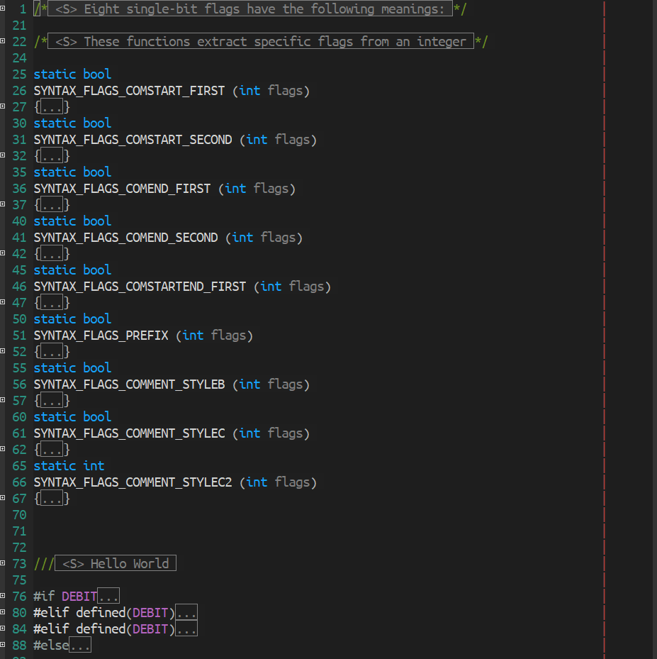
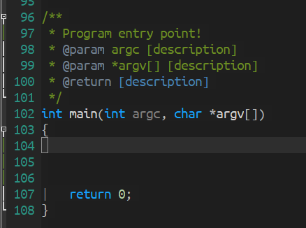
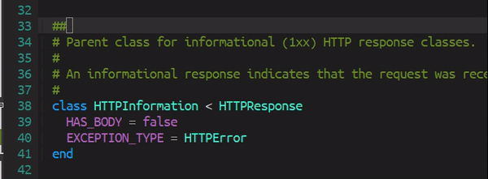

[](https://www.gnu.org/licenses/gpl-3.0)
[](https://jcs-emacs.github.io/jcs-elpa/#/ts-fold)

# ts-fold

> Code-folding using tree-sitter

[](https://github.com/emacs-tree-sitter/ts-fold/actions/workflows/test.yml)

`ts-fold` builds on top of [elisp-tree-sitter](https://github.com/emacs-tree-sitter/elisp-tree-sitter)
to provide code folding based on the tree-sitter syntax tree.

<p align="center">

</p>

<!-- Markdown is not able to render links with unicode so after refreshing the toc, select it and:
    `M-x replace-regexp #[^-a-zA-Z] <ret> # <ret>` -->

<!-- markdown-toc start - Don't edit this section. Run M-x markdown-toc-refresh-toc -->

**Table of Contents**

- [ts-fold](#ts-fold)
  - [💾 Installation](#-installation)
    - [🔍 Method 1. with `straight.el` and `use-package`:](#-method-1-with-straightel-and-use-package)
    - [🔍 Method 2. Manual](#-method-2-manual)
  - [🖥 Usage](#-usage)
    - [📇 Commands](#-commands)
    - [🔨 Supported languages](#-supported-languages)
  - [📝 Customization](#-customization)
    - [⚪ Folding on new nodes](#-folding-on-new-nodes)
      - [❔ Example](#-example)
      - [↔ Offset](#-offset)
    - [🔍 Writing new fold functions](#-writing-new-fold-functions)
  - [🔌 Plugins](#-plugins)
    - [⚖️ Indicators Mode](#-indicators-mode)
      - [💾 Installation](#-installation-1)
      - [🖥 Usage](#-usage-1)
    - [📝 Summary](#-summary)
      - [🖥 Usage](#-usage-2)
      - [📝 Customization](#-customization-1)
    - [🌫️ Line-Comment folding](#-line-comment-folding)
      - [🖥 Usage](#-usage-3)
  - [🔰 Contribute](#-contribute)
    - [❓ How to add a folding parser?](#-how-to-add-a-folding-parser)
    - [🔍 Where can I look for tree-sitter node?](#-where-can-i-look-for-tree-sitter-node)
    - [❓ How to create a summary parser?](#-how-to-create-a-summary-parser)

<!-- markdown-toc end -->

## 💾 Installation

### 🔍 Method 1. with `straight.el` and `use-package`:

```elisp
(use-package ts-fold
  :straight (ts-fold :type git :host github :repo "emacs-tree-sitter/ts-fold"))
```

### 🔍 Method 2. Manual

```sh
git clone https://github.com/emacs-tree-sitter/ts-fold /path/to/lib
```

then in Emacs:

```elisp
(add-to-list 'load-path "/path/to/lib")
(require ts-fold)
```

or

```elisp
(use-package ts-fold
  :load-path "/path/to/lib")
```

## 🖥 Usage

### 📇 Commands

The following are the functions provided by `ts-fold-mode`

Commands for enabling `ts-fold`:

| Commands                         | Description                                                                                         |
|----------------------------------|-----------------------------------------------------------------------------------------------------|
| `ts-fold-mode`                   | enable `ts-fold-mode` in the current buffer.                                                        |
| `global-ts-fold-mode`            | enable `ts-fold-mode` whenever tree-sitter is turned on and the major mode is supported by ts-fold. |
| `ts-fold-indicators-mode`        | enable ts-fold with indicators in the current buffer. See [plugins section](#-indicators-mode).     |
| `global-ts-fold-indicators-mode` | enable ts-fold with indicators globally. See [plugins section](#-indicators-mode).                  |
| `ts-fold-line-comment-mode`      | enable line comment folding.                                                                        |

Commands for using `ts-fold`.

| Commands                   | Description                                                                   |
| -------------------------- | ----------------------------------------------------------------------------- |
| `ts-fold-close`            | fold the current syntax node.                                                 |
| `ts-fold-open`             | open the outermost fold of the current syntax node. Keep the sub-folds close. |
| `ts-fold-open-recursively` | open all folds inside the current syntax node.                                |
| `ts-fold-close-all`        | close all foldable syntax nodes in the current buffer.                        |
| `ts-fold-open-all`         | open all folded syntax nodes in the current buffer.                           |
| `ts-fold-toggle`           | toggle the syntax node at `point'.                                            |

If evil mode is loaded, then these commands are also added to the evil folding list.

### 🔨 Supported languages

> ⚠️ Please sort these two lists alphabetically!

These languages are fairly complete:

- Bash
- C / C++ / C# / CSS
- Elixir
- Go
- HTML
- Java / JavaScript / JSX / JSON / Julia
- Nix
- PHP / Python
- R / Ruby / Rust
- Scala / Swift
- TypeScript / TSX

These languages are in development:

- Agda
- Elm
- Emacs Lisp
- OCaml
- XML (upstream)

## 📝 Customization

Although ts-fold aims to have good folding out of the box for all supported
definitions, people will indubitably have their own preferences or desired
functionality. The following section outlines how to add your own folding
definitions and folding functions to make ts-fold work for you. If there are any
improvements you find for existing or new languages, please do raise a PR so
that others may benefit from better folding in the future!

### ⚪ Folding on new nodes

Ts-fold defines all its folding definitions in the the variable
`ts-fold-range-alist` which is an alist with the key of the alist being the
mode and the value being another alist of fold definitions.

```elisp
;; Example of ts-fold-range-alist's structure
'((c-mode     . c-folding-definitions) ;; <language>-folding-definitions is structured as shown below
  (css-mode   . css-folding-definitions)
  (go-mode    . go-folding-definitions)
  (scala-mode . scala-folding-definitions)
  ...)

;; Examle of a folding definition alist
(setq css-folding-definitions
    (block   . ts-fold-range-seq)
    (comment . ts-fold-range-c-like-comment))
```

So you can select whatever node that you want to fold on it.

To find what node you'll want to fold closed, refer to the
[tree-sitter documentation](https://emacs-tree-sitter.github.io/getting-started/#view-the-syntax-tree)
about viewing nodes. `tree-sitter-debug` and `tree-sitter-query-builder`
are both very useful for this.

For the folding functions, ts-fold provides some default

- `ts-fold-range-seq` - Folds from the start of the node to the end of the node
  leaving a buffer of one character on each side. Usually used for code blocks
  that have bracketing delimiters.

  ```c++
  int main() { // <-- start of tree-sitter block node
      printf("Hello, World\n");
      return 0;
  } // <-- end of tree-sitter block node

  // |
  // | '(block . ts-fold-range-seq)
  // V

  int main() {...} // Folded node
  ```

- `ts-fold-range-markers` - Folds the node starting from a giving delimiter
  character. Useful if tree-sitter's node definition doesn't align with the
  start of the desired folding section.

  **NOTE:** This folding function requires a lambda (or an externally
  defined function wrapper) so that the delimiter can be specified. You
  usually don't need to worry about the `node` and `offset` variables, so just
  pass them through.

```go
type Dog interface {
    Bark() (string, error)
    Beg() (bool, error)
}

/* | Note: The tree-sitter node starts at the word interface, not at the '{'.
 * | '(interface_type . (lambda (node offset)
 * |                      (ts-fold-range-markers node offset "{" "}")))
 * V
 */

type Dog interface {...}
```

- `ts-fold-range-block-comment` - Folds multi-line comments that are of the form
  `/*...*/`. Should show a summary if the commentary plugin is turned on.

  ```c++
  /*
   * The main function that gets run after program is compiled
   * Doesn't take any parameters
   */
  int main() {
      printf("Hello, World\n");
      return 0;
  }

  // |
  // | '(comment . ts-fold-range-block-comment)
  // V

  /* <S> The main function that gets run after program is compiled */
  int main() {
      printf("Hello, World\n");
      return 0;
  ```

- `ts-fold-range-line-comment` - For languages that have one line comment blocks
  with the comment delimiter starting each line. Condenses all the comment nodes
  into a single fold.

  **Note:** This folding function requires a lambda (or an externally
  defined function wrapper) so that the delimiter can be specified. You
  usually don't need to worry about the `node` and `offset` variables, so just
  pass them through.

  ```sh
  # show the long form of ls
  # and also display hidden files
  alias ll='ls -lah'

  # |
  # | (comment (lambda (node offset) (ts-fold-range-line-comment node offset "#"))))
  # V

  # show the long form of ls...
  alias ll='ls -lah'
  ```

- `ts-fold-range-c-like-comment` - A shortcut for the large number of languages
  that have the c style comment structures `/*...*/` and `// ...`. Smartly picks
  the correct folding style for the comment on the line.

  ```c++
  /*
   * The main function that gets run after program is compiled
   * Doesn't take any parameters
   */
  int main() {
      // print hello world
      // and a new line
      printf("Hello, World\n");
      return 0;
  }

  // |
  // | '(comment . ts-fold-range-c-like-comment)
  // V

  /* <S> The main function that gets run after program is compiled */
  int main() {
      // <S> print hello world
      printf("Hello, World\n");
      return 0;
  ```

Now that you know what kinds of folds are easily available in ts-fold, you can
go ahead and add new fold definitions to `ts-fold-range-alist` and be good to go!

#### ❔ Example

Let's look at a quick example of adding a new folding definition. Lets say you
want to add folding to `go-mode`'s `field_declaration_list`. The folding
definition that is needed will be
`'(field_declaration_list . ts-fold-range-seq)`. To add this to the
`ts-fold-range-alist`, you can do something like the following.

```emacs-lisp
(push '(field_declaration_list . ts-fold-range-seq) (alist-get 'go-mode ts-fold-range-alist))
```

Now the new fold definition should be usable by ts-fold!

#### ↔ Offset

With the functions listed above you'll be able to define most folding behavior
that you'll want for most languages. However, sometimes you'll have a language
where the delimiter is a word instead of a single character bracket and you want
to offset your fold by a certain amount to accommodate it. That's where offsets
come in. When adding a fold definition to a a language's fold alist, you can
either provide the folding function directly as you've seen so far:

```elisp
'(block . ts-fold-range-seq)
```

Or you can provide the folding function with an offset:

```elisp
'(block . (ts-fold-range-seq 1 -3))
```

When a range is provided, it provides extra room on the ends of a fold. The way
this works is most easily shown using an example. Lets say we want to write a
fold for bash's `for...do...done` construct to look something like this:

```sh
for i in 1 2 3 4 5
do
   echo "Welcome $i times"
done

# |
# | '(do_group . <some folding function>)
# V

for i in 1 2 3 4 5
do...done
```

The `do...done` block is represented in tree-sitter as the node named
`do_group`. However, if we just use `'(do_group . ts-fold-range-seq)`, then
we'll get results like the following:

```emacs-lisp
for i in 1 2 3 4 5
d...e
```

which is hard to read. Instead, we can use the definition
`'(do_group . (ts-fold-range-seq 1 -3))` to offset the fold a bit to get our
desired result!

### 🔍 Writing new fold functions

If the built in functions don't fit your needs, you can write your own fold
parser! Folding functions take two parameters:

- `node` - the targeted tree-sitter node; in this example, `block` will be the
  targeting node.
- `offset` - (optional) a cons of two integers. This is handy when you have
  a similar rule with little of positioning adjustment.

Then the function needs to return a position range for the fold overlay in the
form `'(start-of-fold . end-of-fold)`. If `nil` is returned instead of a range,
then no fold is created. This can be useful if you want to add extra conditional
logic onto your fold.

As an example of a folding function, take a look at the definition of the
basic `ts-fold-range-seq`.

```elisp
(defun ts-fold-range-seq (node offset)
  "..."
  (let ((beg (1+ (tsc-node-start-position node)))  ; node beginning position
        (end (1- (tsc-node-end-position node))))   ; node end position
    (ts-fold--cons-add (cons beg end) offset)))    ; return fold range
```

## 🔌 Plugins

ts-fold comes with a couple of useful little additions that can be used or
turned off as desired.

### ⚖ Indicators Mode

<p align="center">

</p>

This plugin adds interactive visual markers in the gutter that show where folds
can be made. They can be clicked on to fold or unfold given nodes.

#### 💾 Installation

`ts-fold-indicator-mode` is loaded when `ts-fold-mode` is and the functionality
should be auto-loaded in, however if that's not working then you may want to
explicitly declare the package in in your config.

- `use-package`

  ```elisp
  (use-package ts-fold-indicators
  :straight (ts-fold-indicators :type git :host github :repo "emacs-tree-sitter/ts-fold"))
  ```

- ```elisp
  (add-to-list 'load-path "/path/to/lib")
  (require ts-fold)
  ```

  or

  ```elisp
  (use-package ts-fold-indicators
     :load-path "/path/to/lib")
  ```

#### 🖥 Usage

You can then enable this manually by doing either of the following:

```
M-x ts-fold-indicators-mode

M-x global-ts-fold-indicators-mode
```

Please note that turning on `ts-fold-indicators-mode` automatically turns on
`ts-fold-mode` as well. Though, turning off `ts-fold-indicators-mode` does not
turn off `ts-fold-mode`

- To enable this automatically whenever `tree-sitter-mode` is enabled, use the global indicator mode:

  ```elisp
  (global-ts-fold-indicators-mode 1)
  ```

  Else, a hook can be added to tree-sitter directly.

  ```elisp
  (add-hook 'tree-sitter-after-on-hook #'ts-fold-indicators-mode)
  ```

- To switch to left/right fringe: (Default is `left-fringe`)

  ```elisp
  (setq ts-fold-indicators-fringe 'right-fringe)
  ```

- To lower/higher the fringe overlay's priority: (Default is `30`)

  ```elisp
  (setq ts-fold-indicators-priority 30)
  ```

- To apply different faces depending on some conditions: (Default is `nil`)

  For example, to coordinate [line-reminder](https://github.com/emacs-vs/line-reminder)
  with this plugin.

  ```elisp

  (setq ts-fold-indicators-face-function
        (lambda (pos &rest _)
          ;; Return the face of it's function.
          (line-reminder--get-face (line-number-at-pos pos t))))

  (advice-add 'line-reminder-transfer-to-saved-lines :after
              ;; Refresh indicators for package `ts-fold'.
              #'ts-fold-indicators-refresh)
  ```

### 📝 Summary

<p align="center">

</p>

This plugin automatically extracts summary from the comment/document string,
so you can have a nice way to peek at what's inside the fold range.

#### 🖥 Usage

- If you don't want this to happen, do: (Default is `t`)

  ```elisp
  (setq ts-fold-summary-show nil)
  ```

- Summary are truncated by length: (Default is `60`)

  ```elisp
  (setq ts-fold-summary-max-length 60)
  ```

- The exceeding string are replace by: (Default is `"..."`)

  ```elisp
  (setq ts-fold-summary-exceeded-string "...")
  ```

- To change summary format: (Default is `" <S> %s "`)

  ```elisp
  (setq ts-fold-summary-format " <S> %s ")
  ```

#### 📝 Customization

Just like with fold definitions, you can create your own summary definitions.
Summary definitions are defined in `ts-fold-summary-parsers-alist` and has one
summary function per major mode `'(java-mode . fold-summary-function)`. The
summary function takes in the doc string which is all the text from a doc node
and then returns a string to be displayed in its stead. Unlike with the folding
functions, there aren't a set of general summary functions to fall back on.
However, there are lots of examples and helper functions present in
`ts-fold-summary.el`. Let's look at one example here.

```emacs-lisp
(defun ts-fold-summary-javadoc (doc-str)
  "Extract summary from DOC-STR in Javadoc."
  (ts-fold-summary--generic doc-str "*")) ;; strip the '*' and returns the first line
```

As can be seen `ts-fold-summary--generic` is a very helpful function since it
removes the provided delimiter and returns the first line. often this will be
enough.

### 🌫 Line-Comment folding

<p align="center">

</p>

This plugin makes line comment into foldable range.

#### 🖥 Usage

  ```
  M-x ts-fold-line-comment-mode
  ```

## 🔰 Contribute

[](http://makeapullrequest.com)
[](https://github.com/bbatsov/emacs-lisp-style-guide)
[](https://www.paypal.me/jcs090218)
[](https://www.patreon.com/jcs090218)

Enable `tree-sitter-mode` first, then `tree-sitter-query-builder` is useful to test
out queries that determine what syntax nodes should be foldable and how to fold
them. [emacs-tree-sitter](https://ubolonton.github.io/emacs-tree-sitter/syntax-highlighting/queries/)
has an excellent documentation on how to write `tree-sitter` queries.

### ❓ How to add a folding parser?

When adding a new folding parser, add the folding definition function to
`ts-fold.el` itself near where the other range functions live and then add the
parser to `ts-fold-parsers.el` file. Finally, if you are adding support for a
new language, remember to add it to the `ts-fold-range-alist` variable.

When creating a new parser, name it `ts-fold-parsers-<language>`.

When creating a new folding function, name it
`ts-fold-range-<language>-<feature>` or something similar.

#### 🔍 Where can I look for tree-sitter node?

Here are some techniques for finding your desired nodes in tree-sitter.

To look for the correct node you have three options:

- look at the `tree-sitter-[lang]/grammar.js` implementation. In the above
  example, `block` node is defined in the
  [tree-sitter-c-sharp](https://github.com/tree-sitter/tree-sitter-c-sharp)'s
  `grammar.js` file
- open a file of your language choice in emacs and `M-x tree-sitter-debug-mode`.
  This will display the whole s-expr representing your file
- `(message "%S" (tsc-node-to-sexp))` in your function to display what your
  function is seeing

> ⚠️ Warning
>
> Make sure you look into the correct repository. Repositories are managed
> under [tree-sitter-langs](https://github.com/emacs-tree-sitter/tree-sitter-langs)'s
> using git submodule. Some tree-sitter module aren't using the latest version!

### ❓ How to create a summary parser?

`ts-fold-summary.el` module is used to extract and display a short description
from the comment/docstring.

To create a summary parser, you just have to create a function that could
extract comment syntax correctly then register this function to
`ts-fold-summary-parsers-alist` defined in `ts-fold-summary.el`.
The display and shortening will be handled by the module itself.

Functions should be named with the prefix `ts-fold-summary-` followed by
`style name`. For example, to create a summary parser for Javadoc style, then it
should be named `ts-fold-summary-javadoc`.
